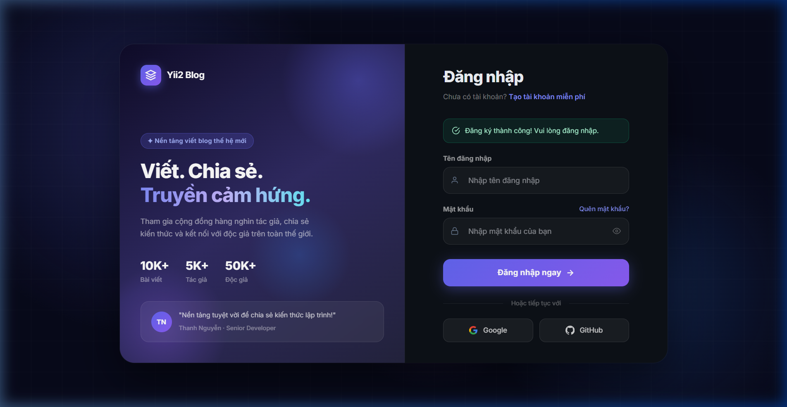
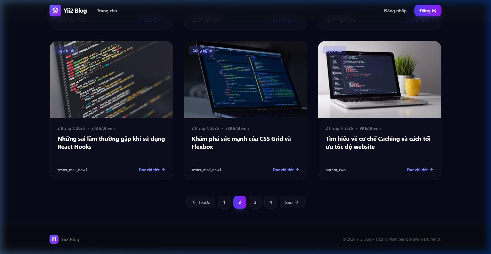
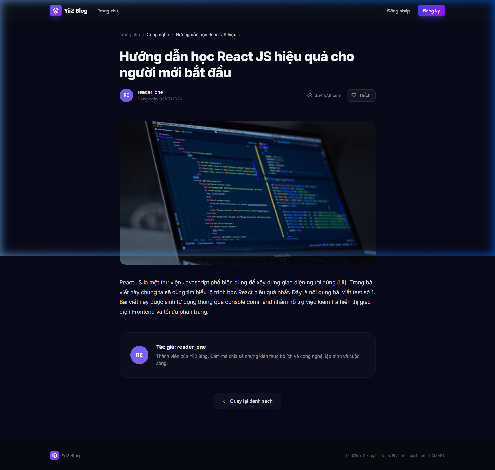

# 🪐 Yii2 Blog Platform - React SPA Frontend

[](https://react.dev/)
[](https://vitejs.dev/)
[](https://tailwindcss.com/)
[](http://www.yiiframework.com/)

Một ứng dụng Single Page Application (SPA) viết blog hiện đại, giao diện trực quan và trải nghiệm người dùng mượt mà. Dự án được phát triển bằng **React JS** kết hợp **Tailwind CSS v4** ở phía Frontend, giao tiếp trực tiếp với hệ thống **Yii2 RESTful API** phía Backend.

---

## 🌟 Tính năng nổi bật

### 1. Luồng Xác thực Toàn diện (Secure Auth Flow)
*   **Đăng ký tài khoản (`/register`)**: Biểu mẫu chuyên nghiệp, tích hợp cơ chế kiểm tra lỗi thời gian thực (client-side validation) và phản hồi lỗi nghiệp vụ từ cơ sở dữ liệu backend (như trùng tài khoản, email không đúng định dạng).
*   **Đăng nhập hệ thống (`/login`)**: Sử dụng xác thực bằng Bearer JWT Token được lưu trữ an toàn trong `localStorage`. Tự động gia hạn trạng thái người dùng tại Client.
*   **Chuyển hướng thông minh**: Điều hướng người dùng mượt mà sau khi đăng ký thành công kèm theo banner thông báo trạng thái trực quan.

### 2. Danh sách bài viết & Phân trang tối ưu
*   **Grid layout thông minh**: Tự động thay đổi kích thước linh hoạt theo thiết bị di động, máy tính bảng và máy tính để bàn.
*   **Đồng bộ Phân trang (Pagination)**: Giới hạn 6 bài viết mỗi trang. Giao tiếp trực tiếp với engine phân trang của Yii2 (tham số `page` và `per-page`) giúp giảm tải thời gian tải trang ban đầu.
*   **Ảnh đại diện Unsplash**: Tự động gán ảnh chất lượng cao tương thích với từng chủ đề bài viết.

### 3. Chi tiết bài viết & Tương tác cao cấp (`/posts/:id`)
*   **Trình đọc bài viết**: Hỗ trợ render nội dung bài viết HTML chuẩn hóa an toàn bằng cơ chế `dangerouslySetInnerHTML`.
*   **Thích bài viết (Like System)**: Tích hợp nút thích tương tác thời gian thực, gửi tín hiệu trực tiếp đến endpoint backend và cập nhật số lượt thích lập tức.
*   **Thẻ tags & Chuyên mục**: Phân loại bài viết rõ ràng, trực quan giúp cải thiện trải nghiệm điều hướng.

---

## 📁 Cấu trúc thư mục mã nguồn

```text
src/
├── api/
│   ├── axiosInstance.js    # Cấu hình Axios, tự động đính kèm Bearer Token & xử lý lỗi 401
│   └── services.js         # Khai báo tập trung các API endpoints (Auth, Posts, Tags, Comments...)
├── components/
│   └── layout/             # Các components bao bọc (Layout, Header, Footer)
├── context/
│   └── AuthContext.jsx     # Quản lý trạng thái đăng nhập toàn cục của ứng dụng
├── pages/
│   ├── Home.jsx            # Trang chủ hiển thị danh sách bài viết kèm phân trang
│   ├── Login.jsx           # Trang đăng nhập cao cấp (Dark theme)
│   ├── Register.jsx        # Trang đăng ký cao cấp (Dark theme)
│   └── PostDetail.jsx      # Trang hiển thị chi tiết nội dung bài viết & tương tác thích bài viết
├── App.jsx                 # Cấu hình định tuyến (Routing) chính của ứng dụng
└── index.css               # Điểm khởi tạo Tailwind CSS v4 và cấu hình các biến tùy chỉnh
```

---

## 🛠️ Cài đặt & Chạy dưới local

### Yêu cầu hệ thống
*   [Node.js](https://nodejs.org/) (Khuyến nghị phiên bản LTS từ 18 trở lên)
*   [npm](https://www.npmjs.com/) hoặc [yarn](https://yarnpkg.com/)

### Các bước khởi chạy

1.  **Clone repository về máy local:**
    ```bash
    git clone https://github.com/giathu012a3/yii2_Blog_Frontend.git
    cd yii2_Blog_Frontend
    ```

2.  **Cài đặt các gói thư viện phụ thuộc:**
    ```bash
    npm install
    ```

3.  **Thiết lập biến môi trường:**
    Tạo file `.env` tại thư mục gốc của dự án và chỉ định URL của Yii2 API Server:
    ```env
    VITE_API_BASE_URL=http://yii2-app-basic.test
    ```

4.  **Khởi chạy môi trường phát triển (Local Development Server):**
    ```bash
    npm run dev -- --port 5173
    ```
    Ứng dụng sẽ hoạt động tại địa chỉ: [http://localhost:5173](http://localhost:5173)

5.  **Biên dịch sản phẩm (Production Build):**
    ```bash
    npm run build
    ```

---

## 🛰️ Tích hợp API (Axios Configuration)

Ứng dụng cấu hình Axios Interceptors nhằm nâng cao tính bảo mật và trải nghiệm người dùng:
*   **Request Interceptor**: Tự động trích xuất `auth_token` trong `localStorage` và đóng gói vào Header của tất cả các yêu cầu gửi đi:
    ```javascript
    config.headers['Authorization'] = `Bearer ${token}`;
    ```
*   **Response Interceptor**: Lắng nghe phản hồi từ máy chủ. Nếu nhận mã trạng thái `401 Unauthorized` (Token hết hạn hoặc không hợp lệ), ứng dụng sẽ tự động xóa sạch bộ nhớ tạm thời và chuyển hướng người dùng về trang Đăng nhập (`/login`).

---

## 🎨 Ngôn ngữ thiết kế (Premium Design System)
*   **Tone màu chủ đạo**: Sử dụng các màu tối sang trọng làm nền (`#07091a`, `#0d1117`) kết hợp với hiệu ứng gradient ánh sáng màu tím và xanh dương mang lại giao diện hiện đại kiểu Metaverse.
*   **Glassmorphism**: Các Panel chức năng sử dụng hiệu ứng kính mờ thông qua CSS backdrop-filter để tăng chiều sâu cho ứng dụng.
*   **Typography**: Sử dụng font chữ không chân **Inter** chuẩn công nghệ giúp tối ưu trải nghiệm đọc văn bản của độc giả.

---

## 📸 Hình ảnh giao diện thực tế

### Đăng nhập & Thông báo đăng ký thành công


### Trang chủ kèm Phân trang bài viết


### Chi tiết bài viết hiển thị đầy đủ

